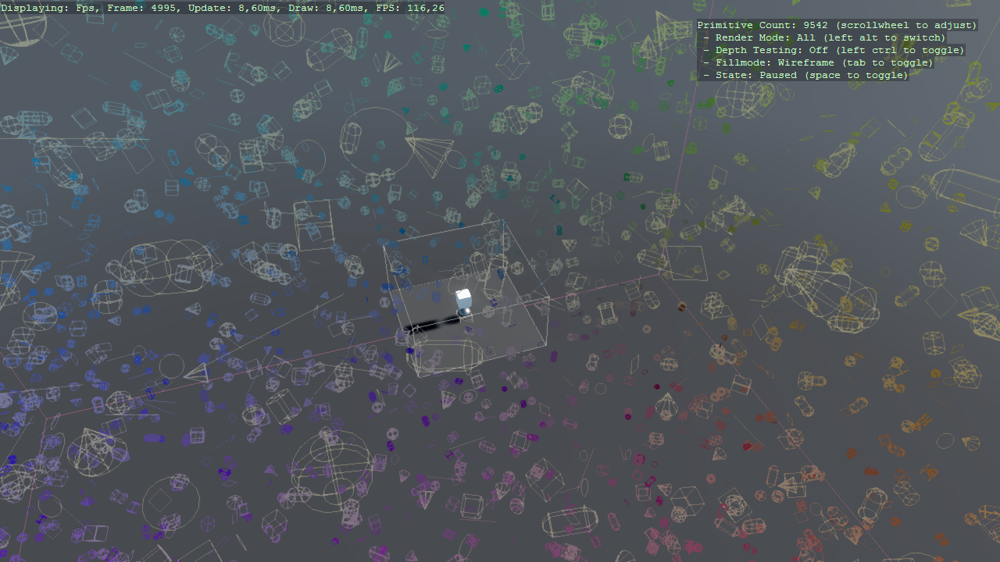

XenkoDebugRendering
---------------------
This is a testing ground for what will hopefully be included in Xenko itself for debug rendering purposes, immediate-mode type rendering of boxes, lines, cylinders, capsules, cones, etc.

It consists of:
1. A RootRenderFeature which does the actual rendering, split up into stages as specified so that later multithreading should just work optimistically.
2. A DebugSystem which acts as a user-level layer and resubmits data every frame as long as the data is relevant (only really relevant for any data that has a lifetime). .. the relevance of this second part should probably be looked at, but for now it is what it is.

Run the project to see what it does, or look in the implementation of the users interface towards it [DebugSystem](DebugRendering/DebugSystem.cs), or the render feature itself [DebugRenderFeature](DebugRendering/DebugRenderFeature.cs) and the user-side script which uses it for testing it at the moment: [DebugTest](DebugRendering/DebugTest.cs).

Project is currently on **Xenko 3.1.0.1-beta02-0674**.

